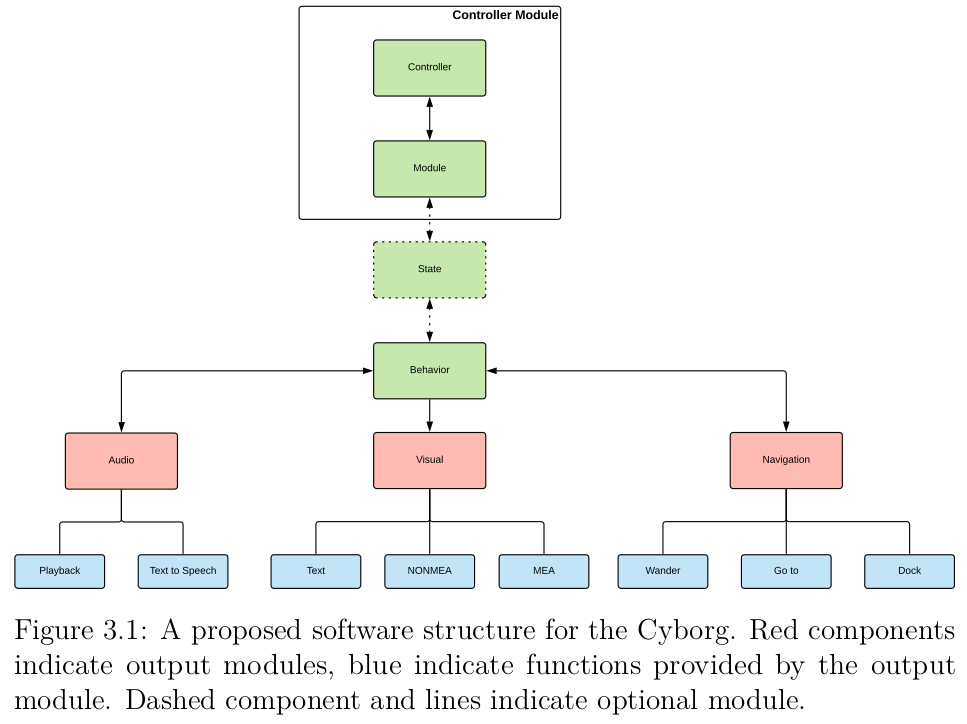

Archive of the CyborgRobot versions v2-v3 developed between 2017-2019 by:
- Areg Babayan (2019)
- Jørgen Waløen (2018)
- Thomas Andersen (2017)

See the reports by these students as well as folder READMEs for descriptions.

### ROS-based system architecture
See an [overview of the system](https://www.ntnu.no/wiki/display/cyborg/ROS+state-machine)

